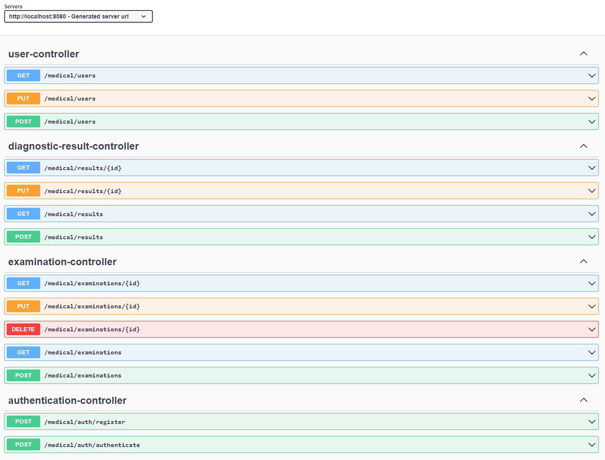

# Medical Laboratory Service
[](https://github.com/viepovsky/Medical-Laboratory-Service/actions/workflows/maven.yml)
[](https://codecov.io/gh/viepovsky/Medical-Laboratory-Service)

Medical Laboratory Service is a secure **RESTful** application that allows patients to access their laboratory test results online. 
The application's endpoints are protected using JSON Web Tokens, ensuring that only authorized users can access sensitive medical data. 
The application stores user personal data, as well as diagnostic results. Users after authorization can simply view and download their results online. 
In addition, the application allows patients to browse available examinations that are offered by the laboratory. 
This application is specifically designed to be used by medical laboratories.

##### Note: This is a backend of such service.

## Technnologies

The application currently uses the following frameworks and technologies: 

- Spring Boot: Web, Data JPA, Test, Validation
- Endpoints secured using Spring Security with JSON Web Tokens (JWT)
- Hibernate
- Unit tests with: JUnit, Mockito, AssertJ
- PostgreSQL + H2 for unit tests
- Flyway
- Lombok
- Maven
- Swagger

In this service I have used my own PESEL validation library to ensure the correctness of PESEL numbers. The library has been published on Maven Central Repository and is accessible for everyone to use. You can check out the library's code [**here**](https://github.com/viepovsky/PESEL).

## How to run

### Using Docker
If Docker is installed and running you can simply run the entire application by executing docker compose up -d in the terminal. 
Wait for containers to start then you can send requests to `http://localhost:8080` to test the application.

### Without Docker

To run the application, you need to have `Postgres` installed. You have to create a database named `medical`, or use a different one by updating the configuration in `application.yml`. 
Make sure to also check the username and password for the database.

Before starting the application, you need to set an environment variable named `MEDICAL_SECRET_KEY` with a 256-bit hex encryption key or copy the one from `application-test.yml` and paste it into `application.yml`.

To start the application, you can either run the `MedicalLaboratoryApplication` class, or type `./mvnw spring-boot:run` in your IDE terminal.

Once the application is running, you can test it by sending requests to the endpoints using tools like Postman. The application runs on `http://localhost:8080/`

Keep in mind that the application is secured with JWT token. To access the endpoints, you need to either register a new user at `http://localhost:8080/medical/auth/register`, or use the provided test user with user privileges (login: `testuser`, password: `testpassword`) or the test admin user (login: `testadmin`, password: `testpassword`).

## Future plans for the application

Next, I plan to add user and admin views to the application using HTML, CSS, and JavaScript.

## Example usage

### 1. Logging to service as ADMIN(testadmin)

POST to `http://localhost:8080/medical/auth/authenticate`

With body:
```json
{
    "login":"testadmin",
    "password":"testpassword"
}
```
You will receive in response authorization token, keep it.

### 2. Uploading medical results for specific USER(testuser)

POST to `http://localhost:8080/medical/results`

With body:
```json
{
    "userLogin": "testuser",
    "status":"AWAITING_RESULT",
    "registration":"2020-11-15T20:11:10",
    "type":"URINE",
    "resultsPdf": <PLEASE SEE BELOW>
}
```
[Link](https://gist.githubusercontent.com/viepovsky/83aecbe695db92c970f329974b4ae6fe/raw/929be3032282bfbda5d1ac349d4dbf8c8b01f514/dummy%2520pdf%2520byte%2520array.txt) to GitHub gist with byte array to paste in `resultsPdf`

Don't forget to put authentication code that you have received before as `Bearer Token`

### 3. Login as USER(testuser)

POST to `http://localhost:8080/medical/auth/authenticate`

With body:
```json
{
    "login":"testuser",
    "password":"testpassword"
}
```
You will receive in response authorization token, keep it.

### 4. Get all diagnostic results for USER(testuser)

GET to `http://localhost:8080/medical/results` with parameter `login`

for example `http://localhost:8080/medical/results?login=testuser`

Don't forget to put authentication code that you have received before for the `testuser` as `Bearer Token`

In response you will receive a list of diagnostic results, keep the listed ID.

### 5. Get PDF for diagnostic result for USER(testuser)

GET to `http://localhost:8080/medical/results/{id}` with parameter `login`

for example `http://localhost:8080/medical/results/501?login=testuser`

Don't forget to put authentication code that you have received before for the `testuser` as `Bearer Token`

In response you should receive a dummy PDF file, as shown below:


## Screenshots




